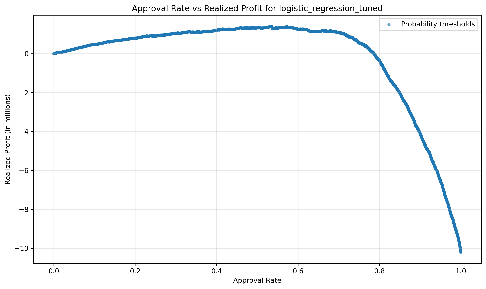
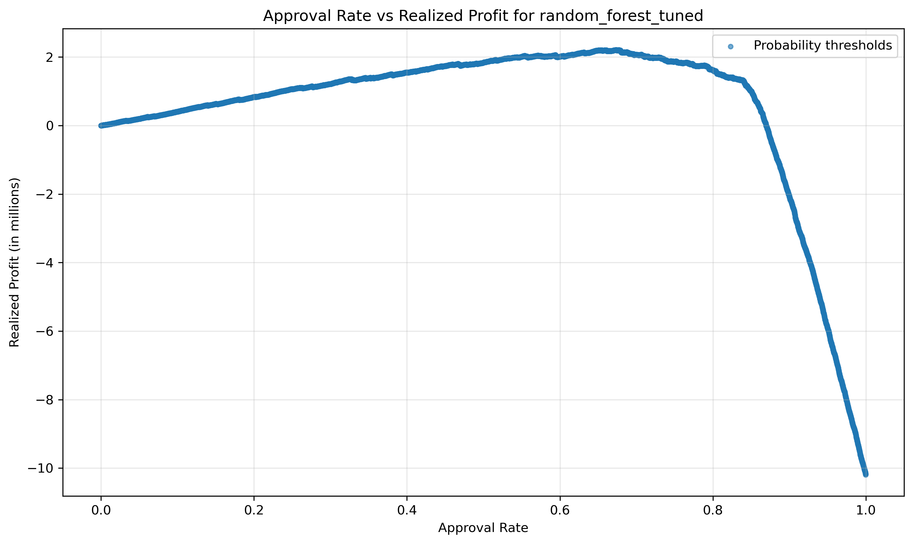
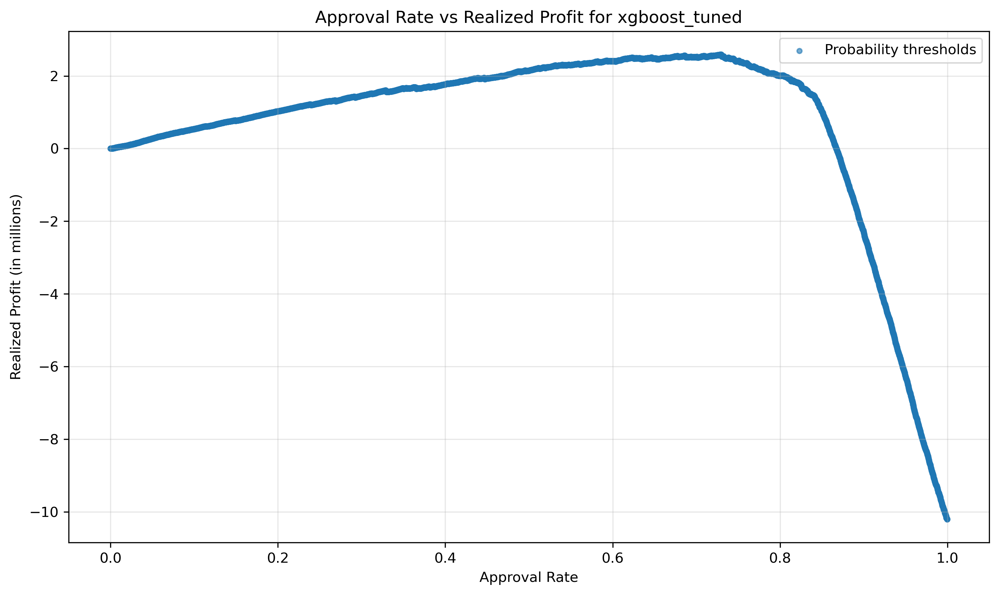

# Credit Risk Default Project

This project uses applicant-level personal and historical credit information to predict loan default probability. In addition to the prediction model, the project includes two planned extensions: a decision layer that converts model output into credit approval decisions, and an LLM-based output translation layer that turns model results into readable business explanations. 

This is based on my previous credit risk project, with the goal of improving the codebase toward a more production-style structure, as well as adding comparison between different models. 

## Project Structure

```text
Credit_Risk_refined/
├── data/
│   ├── raw/
│   └── processed/
├── figures/
├── models/
│   ├── baseline/
│   └── tuned/
├── reports/
├── src/
│   ├── data/
│   ├── decision/
│   ├── models/
│   ├── visualization/
│   └── config.py
├── README.md
└── .gitignore
```

## Prediction

In this section, several classification models are trained and compared for loan default prediction.

### Data Preprocessing

This step includes raw data inspection, data cleaning, and data splitting.

The raw data is first inspected to understand column types, missing values, unique values, and basic data quality issues. Duplicate rows are removed, and rows with invalid or unrealistic values, such as `person_age == 140`, are excluded.

Summary reports for the raw and cleaned datasets can be found here:

- `data/processed/credit_risk_raw_summary.csv`
- `data/processed/credit_risk_processed_summary.csv`

The cleaned data is split into training, validation, and test sets. The split proportions can be adjusted in `src/config.py`.

Model-specific preprocessing, including missing-value imputation, categorical encoding, and feature scaling, is handled inside the sklearn pipeline rather than being directly applied to the cleaned dataset. This helps avoid data leakage and keeps the workflow reproducible.

### Model Training

The model pipelines are defined in:

- `src/models/model_collection.py`

The model pipelines begin with preprocessing steps. Missing values in numerical columns are imputed using the median, while missing values in categorical columns are filled with `"MISSING"` before one-hot encoding. 

The current model comparison includes:

- Logistic Regression
- Random Forest
- Gradient Boosting
- XGBoost

Each model is trained using the same training set. The preprocessing steps and classifier are combined into a single sklearn `Pipeline`, so the same transformations are applied consistently during training and evaluation.

Trained model artifacts are saved locally in the `models/` folder as `.joblib` files. These files are not included in the GitHub repository and can be regenerated by running the training script.

### Model Evaluation

The model comparison report can be found here:

- `reports/model_comparison.csv`

Models are evaluated on the fixed test set using metrics including ROC-AUC, average precision, Brier score, accuracy, precision, recall, F1 score, and the confusion matrix.

ROC-AUC and average precision evaluate ranking performance, while the Brier score evaluates the quality of predicted probabilities. Precision, recall, F1 score, and the confusion matrix are computed using a fixed classification threshold.

The next stage of the project will evaluate different decision thresholds and compare their impact on credit approval decisions, default risk, and expected profit/loss.

### Hyperparameter Tuning

Hyperparameter tuning is conducted for each model using cross-validation on the training set. The tuning process selects the parameter setting with the best cross-validated ROC-AUC score.

The tuned model comparison can be found here:

- `reports/tuning_summary.csv`

The tuned models are saved locally in the `models/tuned/` folder as `.joblib` files. These files are not included in the GitHub repository and can be regenerated by running the tuning script.

## Decision

The decision layer converts predicted default probabilities into loan approval or rejection decisions. In this project, `1` represents predicted default/rejection, while `0` represents predicted non-default/approval.

### Decision Input Preparation

Missing-value handling in the sklearn model pipeline is only applied internally during model training and prediction. It does not modify the original validation or test DataFrames. Therefore, when `loan_amnt` and `loan_int_rate` are reused in the decision layer, their missing values need to be handled separately.

For the decision calculation, missing values in `loan_int_rate` are imputed using the median interest rate from the training set. The interest rate is then converted into decimal form before computing expected cost or realized cost.

### Expected Loss (EL) Score

For each applicant, a net expected Loss score is defined as:

```text
EL = p_default * loan_amnt - (1 - p_default) * loan_amnt * loan_int_rate
```

where `p_default` is the model-predicted probability of default, `loan_amt` is the loan amount, and `loan_int_rate` is the interest rate expressed in decimal form. 
The first term represents expected default loss, assuming full loss of the loan amount if default occurs. The second term represents expected interest income if the applicant does not default. 

### Realized Cost

```text
Realized Cost = sum(FN * loan_amnt) - sum(TN * loan_amnt * loan_int_rate)
```

### Threshold Search

Conducted threshold search on validation set for different cases:
- Threshold on default probability that maximize f1-score, summary stored in `best_thresholds_f1_prob.csv`. 
- Threshold on default probability that minimize total expect cost, summary stored in `best_thresholds_EL_prob.csv`. 
- Threshold on expected cost that minimize total expected cost, summary stored in `best_thresholds_EL_EL.csv`. 

For a given threshold, applicants classified as predicted default are rejected, while applicants classified as predicted non-default are approved. The resulting decisions are evaluated using classification metrics, approval rate, default rate among approved applicants, and realized net cost. 

### Tuned Model Evaluation with Threshold

The selected validation thresholds are then applied to the test set for final decision evaluation. The final test-set decision comparison is stored in:

- `reports/test_decision_comparison.csv`

EL-based thresholds generally produce higher realized profit than the default 0.5 probability threshold, but with a lower approval rate. This highlights the tradeoff between approval volume and portfolio risk.

In particular, XGBoost and Gradient Boosting produce higher realized profit than Logistic Regression and Random Forest under the simplified cost assumption. Threshold searches that use realized net cost as the objective also produce higher realized profit than the default `0.5` threshold or the F1-optimized threshold, which is expected because they are directly optimized for the decision objective.

My preferred policy would be an XGBoost-based model with a threshold selected by minimizing realized net cost, possibly with an additional constraint on approval rate or default rate among approved applicants. 

## Visualizations

### Approval Rate vs. Realized Profit

The following figures show the tradeoff between approval rate and realized profit under different probability thresholds. As the threshold becomes less restrictive, more loans are approved, but realized profit eventually declines because additional approved loans introduce higher default losses. 

The Logistic Regression curve is relatively smooth, while the tree-based models show a more distinct turning point. This suggests that, for the tree-based models, there is a clearer range of approval rates where realized profit is maximized before risk begins to dominate. 

#### Logistic



#### Random Forest



#### XGBoost



## LLM-based Explanation 

tbd